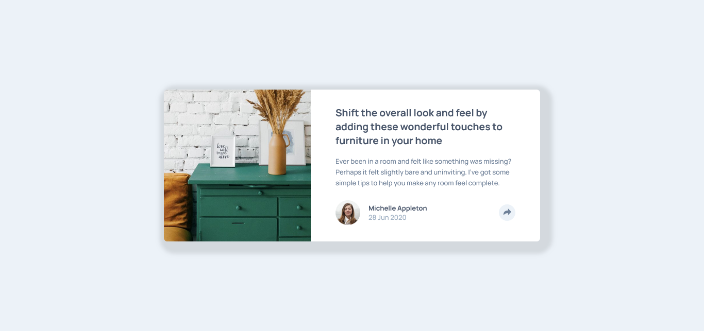

# Frontend Mentor - Article preview component solution

This is a solution to the [Article preview component challenge on Frontend Mentor](https://www.frontendmentor.io/challenges/article-preview-component-dYBN_pYFT). Frontend Mentor challenges help you improve your coding skills by building realistic projects. 

### Screenshot

### Links

- Solution URL: [Solution](https://github.com/tugcekizildg/Article_preview_card_challenge_FEM.io)
- Live Site URL: [Live Preview](https://66a96f8d8a3c6c120102806c--wondrous-gaufre-863d14.netlify.app)

## My process

### Built with

- Semantic HTML5 markup
- CSS custom properties
- Flexbox
- CSS Grid

## Author

- Website - [tugcekizildg](https://github.com/tugcekizildg)
- Frontend Mentor - [@tugcekizildg](https://www.frontendmentor.io/profile/tugcekizildg)

